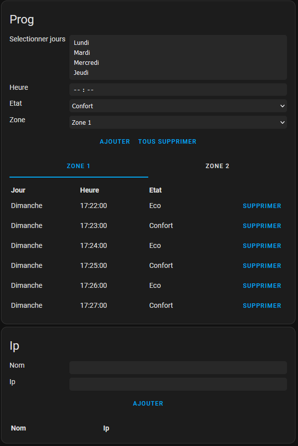

# Heatger frontend


This repository contains the panel and card for home assistant, it's used for manage and control heatger.

---
### table of contents
- **[custom card for home assistant](#heatger-card)**
    - **[Install](#install-1)**
    - **[use](#use)**
- **[custom panel for home assistant](#heatger-panel)**
    - **[Install](#install-2)**
    - **[use](#use-1)**
        - **[auth](#auth)**
        - **[add a programme](#add-a-programme)**
        - **[delete a program](#delete-a-programme)**
        - **[add an ip](#add-an-ip)**
        - **[delete an ip](#delete-an-ip)**

# heatger card

## Install
To install the custom heatger card in the home assistant, you need to copy heatger-card.js in the dist folder to the /config/www/ folder in the home assistant (you can use the file editor in the home assistant).

Then add this card to the resources path: https://developers.home-assistant.io/docs/frontend/custom-ui/registering-resources/

restart home assistant

To finish adding the custom card to your panel, select manual and type :
```yaml
type: custom:heatger-card
```

## use
### toggle state/mode
You can click on the mode/state buttons to change the mode/state(mode: auto<>manual, state: comfort<>eco).
### activate/deactivate frost-free
To activate frost-free, select the end date and click Activate.
when the frost-free is activated, the remaining time to the end is displayed and you can click on the stop button to stop the frost-free.

# heatger panel

## Install
To install the custom heatger panel in the home assistant, you need to copy heatger-panel.js in the dist folder to the /config/www/ folder in the home assistant (you can use the file editor in the home assistant).

Then add the following config in the config.yaml and restart home assistant
```yaml
panel_custom:
  - name: heatger-panel
    url_path: heatger
    sidebar_title: Heatger
    sidebar_icon: mdi:radiator
    module_url: /local/heatger-panel.js
```
After that you can see a new panel in the sidebar.

In this panel you can add/remove programme in the zone 1 and/or zone 2, you can too add/remove ip to the scan list.

## use
This panel only works locally, you can't access it from the outside.

### auth
Before access to the panel, you need to provide your username/password. You can modify them in the config.json file.

### add a programme
- select one or more days(hold ctrl)
- set the time to change the state
- select the desired order
- select the zone
- click on the Add button

Once the new programme has been successfully added, the table is automatically updated.
You cannot add two programmes with the same day and same hour.

### delete a programme
If you click on a Delete button, it will delete the line on the server.(if successful, the table has will be updated automatically).

If you want to delete all the programmes in the current zone(current tab selected), then click on the Delete all button.

### add an ip
- set the name of the ip
- set the ip(xx.xx.xx.xx)
- click on the Add button

If successful, the table has will be updated automatically.

### delete an ip
To delete an ip, then click on the Delete button.
