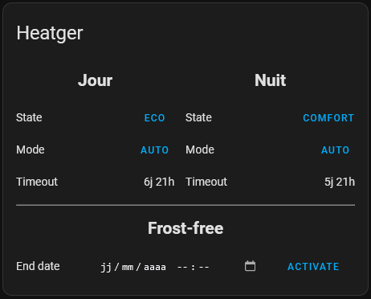

# Heatger card

This repository contains the card for home assistant, it's used for manage and control [heatger integration](https://github.com/kevin-briand/heatger).

This card has English/French translation

---
### table of contents
- **[custom card for home assistant](#heatger-card)**
    - **[Install](#install)**
    - **[use](#use)**

# heatger card

## Install
### With HACS
- Go to the HACS panel
- select 3 dots in the top right corner > Custom repositories
- paste https://github.com/kevin-briand/heatger-card and select dashboard category
- find the heatger card in the list and download it
- add the card "Heatger Card" to a dashboard

The version 1.1 of the card needs the version 2 of the heatger integration (seasons).

### Manual
- copy `dist/heatger-card.js` into the `www` folder of home assistant
- add it as a dashboard resource (`/local/heatger-card.js`, JavaScript module)
- add the card "Heatger Card" to a dashboard

## use
### toggle state/mode
You can click on the mode/state buttons to change the mode/state(mode: auto<>manual, state: comfort<>eco).
### activate/deactivate frost-free
To activate frost-free, select the end date and click Activate.
when the frost-free is activated, the remaining time to the end is displayed and you can click on the stop button to stop the frost-free.
