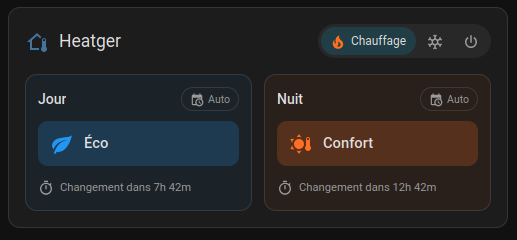

# Heatger card

Dashboard card for the [Heatger integration](https://github.com/kevin-briand/heatger): one tile per zone with its
state, mode and next change, and the current season.

The card follows your Home Assistant theme (light and dark) and is available in English and French.



## Requirements

| Card | Heatger integration |
| --- | --- |
| 2.x | 2.x (seasons) |
| 1.x | 1.x |

## Installation

### With HACS

1. Go to **HACS**, open the menu (three dots, top right) > **Custom repositories**.
2. Add `https://github.com/kevin-briand/heatger-card` with the **Dashboard** category.
3. Find **Heatger Card** in the list and download it.
4. Add the card **Heatger Card** to a dashboard.

### Manual

1. Copy `dist/heatger-card.js` into the `www` folder of your Home Assistant configuration.
2. Add it as a dashboard resource: `/local/heatger-card.js`, type **JavaScript module**.
3. Add the card **Heatger Card** to a dashboard.

## Configuration

```yaml
type: custom:heatger-card
title: Chauffage   # optional, "Heatger" by default
```

## Use

### Zones

Each zone is a tile coloured by its state: orange for **Comfort**, blue for **Eco**, grey when the season is **Stop**.

- **Tap the state** to switch between Comfort and Eco until the next change of the program.
- **Tap the Auto / Manual chip** to suspend the program (manual mode) or follow it again (auto mode).
- The bottom of the tile shows the time until the next change. When Comfort waits for someone to come home, the
  tile pulses and says so.

### Season

The selector at the top right shows the current season (**Heating**, **Cooling** or **Stop**); tap another one to
switch. When the season ends at a given date, the date and the season that follows are shown below.

Scheduling a season (for example "Stop until 1 November, then Heating") is done in the **Heatger** panel of the
sidebar.

## Development

```bash
npm install
npm run build   # compiles to dist/heatger-card.js
```

The release workflow uploads `dist/heatger-card.js` as it is: build and commit it before publishing a release.
